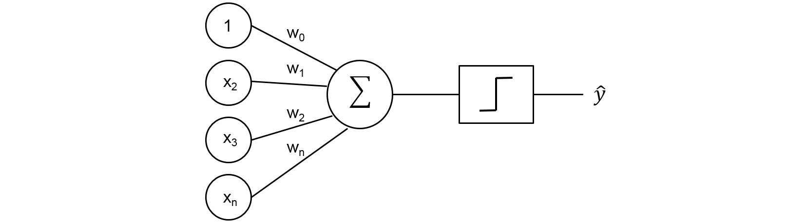

# Observer {#observer}


```{r packages_observer, echo=FALSE, include=FALSE}
library(ggplot2)
library(dplyr)
```


## About this level

Welcome to Level 2: Observer. Once you reach this level, you will be able to act as an Observer of a Data Science project. You are **not yet directly able to contribute** to it (such as through coding), but you will be able to **use outputs of it and help with the inputs**. Thus if you are a campaigns manager in the marketing department, you will know what to ask Data Scientists for and how you can use what they create. Also, you will have some basic tools with which you can **evaluate** whether the Data Scientist that your initiative is dependent on did a good job or not. As I mentioned, you will also be able to help out with inputs. Whether you know it or not - Data Science is dependent on people like you, who have the context knowledge. That is why there is the famous saying, "Garbage in, Garbage out". If you will be able to point a Data Scientist to what he should use and what he should not use, he will be grateful (unless he is stubborn). We will need to develop your skills in three different areas:

Soft understanding of Data Science

- Be Skeptical About Data
- Data Science Project
- Your Contribution to Data Science Project

Programming 

- Data and Computing
- Using Data

Statistics & Machine Learning

- Descriptive Statistics
- Machine Learning
- Supervised Learning

## Be Skeptical About Data

*Is data really powerful?*

Being skeptical about the power and bias in your data is the most **crucial** skill, or **mindset** which you will acquire on this level. Even experienced Data Scientists sometimes forget this point. Firstly, let's think about the power of your data. It might be necessary to ask, whether the data even *can* answer the questions we intend to ask.  

Let's say that you got a task of optimizing bus transportation in your city, a fairly large city. The optimization should bring a benefit that the number of busses on each route should be adjusted to the demand, making passengers happier, thereafter using the busses more, earning you money and helping the environment. The dataset which you have available are:

- Every bus route and number of busses operating it.
- Every bus stop and a delay that every bus had on that particular stop.
- Every ticket bought - at a bus, at a stop or online.

Do you think that this dataset will be sufficient to fulfill the task?

```{r bus, echo = FALSE, fig.cap='Is our data powerful enough to optimize the bus routes?'}
knitr::include_graphics("resources/02-observer/bus.jpg")
```

You do a perfect Data Science project, utilizing the dataset to its maximum. Some of the things you will do based on a dataset:

- Bus routes, where people buy most tickets on their stops will increase in the number of buses operating them. You are hoping that this way, the busses which might be crowded will be more comfortable for the large number of people using this route.  
- Bus routes, where buses tend to be late are rerouted. You found some alternative paths, alternative places for a bus stop and are hoping that this will decrease the delay which buses have, making people more happy.  

Seems reasonable right? There is a catch and let's see what might actually happen as a result of your Data Science project.  

- What will most likely happen is that you might optimize for the opposite. You have increased the buses for people who only occasionally travel with a bus, such as pensioners when they go for a walk in the city centre. You have not optimized for heavy users of bus transportation - commuters who daily commute to and from work.
- Similarly, your change in routes meets the opposite of success. The reason why the buses are late on these routes is that these are the major paths for people in the city to use.  

Why have we failed when we did a perfect Data Science and our assumptions about the bus routes seemed to be very reasonable? The answer is that our **data did not have the power to correctly solve the problem**. What we mainly lacked was the online purchases of tickets as well as yearly subscriptions to public transportation services. Both of these ticket purchases are untraceable. As a matter of fact, people who buy yearly subscriptions are the heaviest users of public transportation and we really have no data about their movement. Thus, our dataset simply did not have the required data. One way to solve this would be to change the system in itself. For instance, even if you have a yearly subscription or a ticket bought online, you have to *tag* it once you enter a bus. It won't withdraw any money from your account, though your yearly ticket will be invalid, unless tagged.  

The message which I wanted to translate with this short example was not how to optimize public transportation, but so that..

> you shall be **skeptical** about the power of your data.

To demonstrate this in my experience, I was once working with a digital banking application and we intended to create budgets to many customers. These budgets would be helping you save money and have an overview of how much you are spending on various categories such as groceries, going out or vacations. Even though I was trying various methods it was not working out well. The budgets were absolutely unstable and customers every month spent different amounts on things. How is it possible? Of course **my data did not have the power** to answer the question I was given. Even though we consume similar amounts of things every month, we do not necessarily buy the same amount due to simple reasons - we share with someone. Usually customers have families, wifes, husbands, friends, flatmates and they share expenses among each other. To solve the task properly I would need to link together the people who share their expenses and only then I would be able to answer the question. 

*Are some data specifically biased?*  

When it comes to data, there are two areas which I tend to distinguish:

- **Machine-related Data** that relate solely to machinery or natural processes, oftentimes collected through sensors. You are a chemical engineer running trials and observing time for a certain reaction to happen. You could be a mechanical engineer watching whether an error won't occur in your machinery. Assuming that your *sensor* is reliable and well setup, your data should be unbiased as both machine and nature (in this sense) are stable in *behavior*.
- **Human-related Data** that display human behavior. *Self-reported data*, such as surveys. Imagine anything from voting polls, through asking whether someone wants to buy our product, up to even reporting an address of residence. *Collected data*, such as logs from mobile applications which are tracking human activity.

To answer our question whether some data are specifically biased, the simple answer is YES. There is a lot of data from my perspective which is just wrong to be used and you as a Embedded Data Scientist should not use. I do now wish to talk now about *data quality* issues, but about the nature of data, which is connected with how the data came into existence.  

There are a lot of datasets which came to existence by **asking people** regarding their state or opinion. Take elections for instance. If you look at US elections in 2016, for a very long time it was seemingly impossible that Trump will win the elections. Yet, he won, even though the data from polls told us otherwise. What happened is that this (poll) dataset was created by asking people, while unfortunately it is in human nature that:

- people lie with purpose
- people are lazy
- people cheat
- people want to appear different than they are
- people do not know themselves

I might seem to be negative again, but this is what my past has taught me. Points which I am mentioning above are in our human nature and now it depends upon whether context will push us into one of these biases. I will bring several examples, but for now let's stick with these. Due to these biases that affect *self-reporting*, when your Data Science project is working with people,

> you should not rely on data which were created through *asking* and *self-reporting*. 

I will be honest, from my perspective all survey data are just wrong and in today's world, I would simply skip this practice as we have better means of data collection.  

Just last week I headed to my bank as a client with the intention of closing my account. I arrived at the branch (which was completely empty due to early hours) and took a place at the advisor. Upon my announcement, the branch advisor said - "You have a different bank?", to which I replied positively. When my churning papers were printed and ready for signature, I noticed that there is an explicit field stating a reason for churning, where of course was "Client has a different bank". There was actually a list of reasons why I was churning - unprofessional staff, bad mortgage offer, bad credit card offerings and expensive services. As a client, I did not argue and let that reason be there. As a Data Scientist though, flames of justice were burning inside of me! Imagine the poor Data Scientist who receives a task to analyze data and determine what causes churn. Oh dear...

Do you think that the bank is not aware of an issue with human biases, such as this one? Of course it is; and so cross-checks are present, when a second advisor needs to arrive to confirm the actions of their colleague. Do you think that the second advisor cares more than the first one about the quality of their data? Of course not. 

Which of the points above occurred in this situation?  

- I was **lazy** and I **did not know myself**. I could tell the bank clerk that having another bank is not the real reason, but I just didn't feel like it. Also, I don't *really* know why am I leaving this bank. One morning I woke up and I felt like I do not want to be their client anymore.
- My branch advisor was I think **cheating**. He was happy that I agreed to the reason that I have a different bank. I could have used one of the reasons that I am unhappy with the service I am receiving at this branch. This would of course cause his colleagues troubles.  

Thus if you end up as the poor Data Scientist in this case,  

> you should seek ways how to *overcome* the biased self-reported data.

Let's assume you work in a bank and your task is to develop a Data Science model which will **automatically be granting loans**. As you are working within the loans department, you very well know that the primary factor for whether your bank will grant a loan is the income of a customer. You also know that there is a field in your database that says *"income"* to each one of your customers. Problem solved right? You just collect a few more fields and create a model as you were asked. Well, I recommend something different.  

If you will ask around you will find out that this *"income"* the field was created through self-reporting of your customers. When they are setting up their account, the advisor in a branch will ask them what is their income and they report figure X. Trust me when I say that due to one of the reasons listed above, the customer will report a wrong number. Ok, then - you tell yourself that you are smarter than that and decide to observe customer's incoming salary transactions which you have tagged in your system. You have overcome the problem of self-reported information, right? You deploy your model into production and run your automatic loaning system. 

What will happen is that in some time frauds will arise and there will be a lot of customers who took huge loans and do not pay them back. How could this happen? Well, people learned how to cheat your model for their own benefit. Fraudsters are now once a month sending each other transactions which are tagged by your system as salaries and thereafter your *"income"* the field for this customer is huge. They are then automatically granted significant loans. So, how can we solve this? 

>The key is to obtain information which is desired through data which was created by humans, while he was doing something completely natural and at best, unrelated.

You need to think about an action, or a process of a customer though which he/she unknowingly **displays his/her truthful income**. What about groceries? We all do grocery shopping, thereafter this might be a reliable source of information. What if you look at how much this customer is spending for groceries monthly and relate it to his/hers assumed income. If you have reported 1500 Euro income, how come that you only spend 100 Euro for groceries? I would rather presume that your income is somewhere around 500 Euro. This is of course not a perfect solution, but what I am trying to translate is the **skeptical thinking** about how to solve the problem with bias about human-related data.

## Data Science Project

*How does a Data Science project create benefit?*

Let's start from the very end, what should a project generate. It should be new information, in various forms, that creates benefit for a person or company that financed this project. Let me emphasize the point of that the project creates **new information, not new data**. This is because data by themselves has no benefit, and thereafter there would be no point in running a project that creates data and not information. This information can be in various forms, so let's take a look at some examples:

- When I was at university I was tasked with creation of project, which would take **recordings of people walking** and it should create an information of whether people on the recordings are suffering from Parkinson's disease or not. Having this information creates various benefits, for instance (if working properly), expensive time for doctors is saved. Ultimately, people could self-administer this test at home without the need of visiting the doctor. The information created was the statement "Has Parkinson disease" or "Does not have Parkinson disease" to every recording.

- Once I ran a project which was supposed to **determine a location of newly opened retail stores** in a country. The input for my project was the network of roads and cities in the country with their respective counts of inhabitants. The information which my project was creating was a potential position of retail stores that would be optimized for a distribution of roads and where people live. This information created a clear benefit - competitive advantage for particular retailers.

- Numerous times in the past I was asked to determine customer's **probability to purchase an item**. My project always took as an input various customer data such as their demographics while it predicted a probability to purchase a particular item (information). This information has a benefit that a business representative can then decide whether he/she will invest into marketing for a particular customer.

```{r parkinson, echo = FALSE, fig.cap='My showcasing how Data Science can diagnose Parkinson disease, through recording of gait on four points on the body.'}

```

I could go on, but I guess you already have the picture of what is the single requirement of any Data Science project - **creating an information from which we benefit**. The beneficial information can now really vary in forms. It can be anything as you already saw, but I would like to broaden your horizon even more. The output of a Data Science project can be a single diagram, or even a sentence (thereafter it does not have to be predictive modelling or optimization only). 

*What does a Data Science project look like?*

Essentially, all Data Science is about are **hypothesis**. This is how hypothesis is defined by Oxford dictionary:

>a supposition or proposed explanation made on the basis of limited evidence as a starting point for further investigation.

You would be surprised by how many Data Scientists are forgetting some parts of this definition so I would like to focus on it. At the beginning of a project you **suppose** something can be done - "We are able to find ideal locations for our retail stores.". Then you examine whether you already do not have enough evidence which would answer your supposition - "There is no other retailer similar to us in a given country and as we are new to the country we also have no knowledge." Finally, as we already discussed, there is a clear benefit if our assumption is fulfilled - "Once ideal locations are found, our stores will be easily accessible by customers and this will be profitable".  

Once you work out your hypothesis, your Data Science project can outset. You will seek for available data that you can use to assess your supposition. In later chapters, you will learn about concepts such as *Minimum-Viable-Product* or *experimentation* that will help you to set up a simple way as possible to assess your supposition. But, let's leave it here from now - remember to always set up a project based on your hypothesis.

## Your Contribution

*How can I contribute to the Data Science project?*

I have to make a small assumption here about who you are. You are someone who works in a certain domain - for example banking, paper industry, insurance, car sales, anything. You either have formal education in this domain, or working experience. This means that you have something that no Data Scientist has - specific knowledge of the domain. Thereafter, as we already mentioned, you can contribute to the Data Science project in two ways already on this level: 

> As Observer, contributes through inputs and through outputs of Data Science projects, not into the central process.

As you already know, the basis of every Data Science project are *data* (input). As you have domain knowledge, you might know about data that Data Scientist is not aware of. I will demonstrate this from one project of mine from the past.  

My project was using log data from a mobile application, whereas users had to go through several screens in order to complete the purchase process. I collected all the log data and what it was showing was that a certain group of users was dropping off from the sales process at various points. I was struggling with it and I was unable to explain why this group of users (which had no clear characteristics) was dropping off at various times during the day. I was then approached by a call center representative, which for several years sells the same product over the phone. He did not even have to look at the data and gave me the answer! These were parents of young children! As the sales process takes an hour to get through all the screens, there is a solid probability that if you are a parent of a baby, the baby will start crying and you will of course leave your computer. The data would never reveal me this pattern, the domain knowledge did instantly. You can be the gentleman from the call centre, which moves the project a light year ahead!

Secondly, every data science project should produce an *information* (output) that will be used to create benefit. This component of the Data Science project is oftentimes underappreciated and you can be the one who fixes it. I will now go back to my projects where I was supposed to predict the probability that a customer purchases a product. I was given this task by our CRM department to optimize email campaigns - so that these are sent only to customers who have decent probability to buy the item. Everything worked well, the Data Science project ran through, the *information* was created. BUT, the created benefit was close to nothing. As it later turned out, customers are generally overfed with emails and digital channels. I then met with a representative from our branch segment and he said that this *information* could be of great use for our sellers. The sellers have only very limited time when the customer approaches them and thereafter having the *information* they will be able to sell more. The data, nor my knowledge of Data Scientist would never reveal this use of the *information* which I created, the domain knowledge did. You can be this representative, who will multiply the created benefit out of a Data Science project.

## Data and Computing

*How is data represented?*  

If you plan on skipping this chapter, because it seems boring, please don't. It would come to haunt you in your glorious future of Embedded Data Scientist. Data Science is done using computers, thereafter I think it is crucial to understand how your computer sees data. We often think that computers are smart, while in fact they are quite basic - they understand only two values - 1's and 0's. In fact some of the earliest computers were presented data through punch cards.

```{r punch-cards, echo = FALSE, fig.cap='Example of how one of the earliest versions of computers from IBM saw data - as punchards with holes (1s) and not-holes (0s). Picture by dansimmons on Twitter'}


```

How is it possible that two values are enough to represent anything to the computer? Through converting numbers into binary form. I do not want to bother you with the details of this method, I just want to tell you that **any number is easily represented in a binary form**.

```{r text-to-binary, echo = FALSE, fig.cap='Example of how texts and numbers can be encoded into binary.'}
knitr::include_graphics("resources/02-observer/text-to_binary.jpg")
```

Now what we often times make mistake with is that we **overestimate powers of computers** and we think that they understand anything - texts, colours, pictures. Well, they don't. They only really well understand numbers as these can be easily converted into binary form. Thereafter a lot of tasks of Data Scientists revolve around representing data well for the computer. If a Data Science project intends to work with images or texts, one of the most crucial tasks is, how do we convert these to numbers, so that they can be represented well for computers in binary forms?

I was at a conference where a Scandinavian bank was representing their project of revealing fraud transactions by the means of Data Science. Transaction usually looks as something like following:

```{r transaction, echo = FALSE, fig.cap='Example of how we view a transaction.'}
knitr::include_graphics("resources/02-observer/transaction.JPG")
```

However what a presenter showed was something like following:

```{r transaction-representation, echo = FALSE, fig.cap='Example of how it might be necessary to alter transaction so that our computer views it correctly.'}

```

One of the keys of their project is how the transactions were represented to the computer (and algorithm). We will get more into this later. Important message that I would like you to learn now is that; 

>**data representation** is one of the key components of successful Data Science.

Usually it will be rather simple to represent data to an algorithm. In the next chapter we are going to learn about data types and in most of the cases this will be sufficient. Though as you will be meeting some more complex projects, such as Natural Language Processing, the topic of data representation will become more prevalent.

*How does my PC handle data?*

As soon as you start a Data Science project, you will be facing hardware limitations. Simple reason for this is that hardware costs. Sure, you can purchase a hardware and have no variable costs, but this hardware will be getting outdated or you might incur opportunity costs. Thereafter, every Data Science project will be optimizing for as little hardware requirements as needed to fulfill particular tasks. These requirements will be coming from four crucial components that a computer has and I think it is hence crucial for you to learn about them now.

In order to process data, and run Data Science project, following four components will be needed and this is how I think about them:

- **CPU** (central processing unit). This is a place where all the calculations take place. When you will work with algorithms which are *computation heavy* and are dependent on the CPU, you will run into limitations. 
- **RAM** (random access memory). This is memory which is instantly accessible to all the programs, thereafter it is super useful to our work when we need to work on some data. When you will work with larger datasets, RAM requirements can become problematic.
- Harddisk. This is your "bookshelf" of data. Once you are done working with your data, you store them here until next time you need them. Usually, harddisk space does not pose limitations to your project, as it is fairly cheap.
- GPU (graphical processing unit, or graphics card). This is an alternative to your CPU, which is considerably more powerful and will come in handy in late chapters of this book.

```{r computer-components, echo = FALSE, fig.cap='Remember that for a Data Scientist hardware matters - mainly CPU and RAM powers.'}
knitr::include_graphics("resources/02-observer/computer-components.jpg")
```

*What is a csv?*  

Now that we know what data is, we also know what we aim to do with it and how will we manage it with our computer, it is time to get our hands on some data. The simplest representation of a dataset is through so called "csv" or **"comma-separated-values"**. In plain form, these might look something like this.

```{r csv-example-1, echo = FALSE, fig.cap='One customer representation in csv form.'}
knitr::include_graphics("resources/02-observer/csv-example-1.JPG")
```

It is quite ugly right? The reason is that data in this form are **not meant for a human eye**, but for programs to read which can in turn display the data in a nicer way for us. Later on when you will be importing such data, you only need to specify two things so that our program knows how to read it in well:

- Separator (what separates columns), in our case `,`.
- Whether the first line is a header (names of columns), in our case `yes`.

If you ever worked in Excel, when you are saving a document, you can decide to save it as ".csv". This is by the way a good practice as the environments you will later on learn to work with can read it easily.

*What is an observation and a feature?*  

Data Science project will be aimed at certain phenomena which is of our *interest*. This can be our customer base, weather, how certain machines operate, how our colleagues work - anything. In order to apply Data Science to this phenomena, we will need to **describe it through observations and features**. *Observation* is some small unit from our phenomena such as a day, one customer, one colleague, one moment of machine's operation. Secondly, *feature* is characteristic of an observation, such as temperature in a given day, age of one customer, arrival of our colleague to work or speed of machine's operation. Here is a small table to summarize it:

| Phenomena | Observation | Feature |
| --------: | ----------: |  -----: | 
| weather | day/hour/minute | humidity |
| customer base | one customer | age of customer|

Throughout your entire career, you will be meeting these two concepts of *observation* and *feature*. These will vary in forms, but the way we described it now will always hold. Thereafter we can adjust our csv file and we can represent in it one customer with some of his features. As a standard, *features* are displayed in **columns**.

```{r one-customer, echo = FALSE, fig.cap='One customer representation in csv form.'}

```

*What is a "flat table"?*  

We now learned how to store data about one customer, but we have many customers right? To store data about all of them in reasonable form, we will use a flat table. It is common to store *observations* in **rows**. Thereafter, we can just add several rows, representing several customers.

```{r flat-table, echo = FALSE, fig.cap='Multiple customers representation in csv form - flat table.'}
knitr::include_graphics("resources/02-observer/flat-table.JPG")
```

*What is granularity?*  

Even though we can now store customer's features nicely, we still haven't won due to the issue of *granularity*. Some of the features about a customer will have different *granularity level* and we are unable to store them in the same table in a nice way. What if we wanted to store cups of coffee per day, per customer. With our current knowledge we could do something like this. 

```{r bad-flat-table, echo = FALSE, fig.cap='It would not make too much sense trying to represent data on different granularities in this way.'}
knitr::include_graphics("resources/02-observer/bad-flat-table.JPG")
```

Ugly right? It would be hard to manipulate such data. We need to solve this by introducing more tables, whereas these are on **different granularity level**. We will call this relational database.

*What is a relational database?*  

Edgar Frank Codd at IBM in 1970 in his paper "A Relational Model of Data for Large Shared Data Banks", introduced a concept of how the problem above can be solved in a neat way. Luckily for us Data Scientists, Oracle implemented this idea into a working software solution in 1979 (Ever wondered how that company became so successful? This is it.).  

We create two tables, with different granularities separately. The only extra point which we need to specify is how are these linked together - for example customer name. 

```{r relational-database, echo = FALSE, fig.cap='Correct representation of data on different granularities - relational database.'}

```

When you will be contributing to a Data Science project, keep the data granularity in mind. If the data of different granularities enter the project, it is necessary to harmonize their granularities. This can be done for instance through data aggregation which you will learn on the next level.

## Using Data

*Can we already do Data Science?*  

Now that we constructed ourselves a small relational database with everything that we know about our customer base, are we ready to do Data Science? Yes, so let's give it a try. We are a coffee seller and we are interested in which age group drinks most of the coffee, so that we can better target our marketing efforts. 

**calculate the example by hand**

*Do I have to do it in this cumbersome way?*  

Luckily, software can of course help us. Now it is time to turn into learning *what* software can help is and *how*. We will need an Integrated-Development-Environment (IDE), engine and maybe a library.

*What is an IDE, engine and package/library?*  

Even though you are right now at the level of Observer, you might already come in touch with programs or libraries which make Data Science projects. Thereafter, it is important to understand the terminology here. The most obvious are so called IDEs - Integrated Development Environments. These are pretty and easy to work in. Currently, some of the most popular ones among Data Scientists are R-Studio and Jupyter Notebooks. This will be a program which runs on a computer (either a physical one or somewhere on the server), that allows you to utilize some computing *engine*.

There are two very popular engines, which are actually competing with each other - R and Python. Imagine these as a set of functions which are very robust and people like to use them because they are well developed and once a Data Scientist works with them, he can be sure that his work will run.  

Finally there are libraries. The engines as well as IDEs are many times licensed under open-source. This makes a lot of sense, because people have a motivation to contribute to these. How will they contribute though? It would be very tricky to integrate work of thousands of people though single software - may it be R or Python. For that, we have *libraries*. These are way smaller sets of functions, which usually serve a specific purpose. For example, even though R serves Data Scientists, you might decide to write a specific library which will be for Data Scientists which are trying to predict zombie apocalypse. You will include a set of specific functions in your library and you may decide to publish it so that other people can use it.

### R

R is an engine (or programming language) in which a lot of Data Scientists today work, because of its simplicity and statistical powers. We are able to solve our task with it with several *lines of code* while we make use of functions which someone else predefined for us. Here is how a solution looks.

**insert R solution to the problem**

Let's talk a little bit about what happens. 
The function mean comes from a predefined library called base.

It's a bit ugly though, as we did not use any pretty IDE. We can write the same code in R-Studio IDE. This is how it looks.

**insert R-Studio solution**

Data Scientists of course like this as you can visually distinguish between various elements. The IDE will have much greater functionalities compared to only working in programming language, but we will get to that later.

### Python

you can download it with.

### Knime

Usually when people talk about Data Scientists, they mention two languages (or frameworks) - R and Python. I however believe that in the future a different approach will dominate if we would like to grow the numbers and powers of Embedded Data Scientists. These are frameworks which do not necessarily require coding, but can do very similar things (at a tradeoff of being slightly less flexible). One such framework is Knime.  

When thinking about Knime, we can forget our distinction between engine and IDE, here we get both things in one. One important difference to R and Python is that here we are not expected to explicitly write code in order to fulfill our data science task. Let's give it a try.

**insert Knime solution**

As you can see we are again doing the same steps, just this time they are represented with visual modules instead of lines of code.

*Should I use R, Python or Knime?*  

As you are on the level of Observer, you should not choose any. At this point, you should only be able to observe a Data Science project, thereafter when your colleagues say that they work in a certain language (most likely one of these three), you know what they talk about and you can see on a very basic level what they are doing.

## Descriptive Statistics

Our toolset is quite limited though so far - we can only use *measures of central tendency*. It is now time to revisit this idea and expand on it with **distributions, percentiles, visualisations and measures of spread**. I would start by showing you *why* measures of central tendency are often times not enough, and we need to learn further tools. Consider two populations, each one is several measurements of temperature:

```{r two_populations_temperature}
stable_climate <- c(11, 12, 13, 14, 15, 16)
unstable_climate <- c(4,10, 14, 18, 20)
```

When we intuitively look at these two populations, they are very different. The first set of temperatures seem to come from a rather "stable" climate when temperatures range between 11-16 degrees. The second set of temperatures seem to be coming from a way more "unstable" climate. On the first day, we seemed to have only 4 degrees and on last day even 20 degrees! Let's see what happens if we deploy our learned *measures of central tendency* on these two populations.

```{r two_populations_temperature_central}
mean(stable_climate)
mean(unstable_climate)
```

Based on mean, our most advanced *measure of central tendency* they appear almost non-different, which is very contradictive to our intuition! The reason is that measures of central tendency will not grasp how are data spreaded, for that, we will need to examine how are observations distributed and spreaded, which is a topic of this chapter.

### Range

Simplest way how we can look at how is our population distributed, is by looking at its range.


### Distributions

*A picture is worth a thousand words*, is an old proverb which is true also for us. Within Data Science, this topic is called Data Visualisation and is very broad. We only tip our toes into its waters now by learning how can we **visualise a distribution**. Why would we even want to visualise a distribution? Let's revisit an example from a previous chapter, where we had salaries distributed such as this:

```{r salaries_country_revisited}
salaries_country <- c(350, 400, 450, 470, 500, 520, 1200, 1270, 1300, 1460, 1500)
```

In this case, it was easy for us to intuitively grasp an idea of what is going on in the population. What is our population looked though like this:

```{r large_salaries_population, include=FALSE}
large_salaries_population <- c(round(rnorm(700, mean = 600, sd = 80)), round(rnorm(300, mean = 1000, sd = 150)))
```

```{r}
head(large_salaries_population, 100)
```

It gets messy right? We can try to order the numbers, but still **our intuitive thinking is failing** when population gets larger. That is why we turn into **distributions plot**. It is one of the simplest plot within Data Visualisation techniques:

- It has two axis: x-axis (horizontal) and y-axis (vertical)
- X-axis displays our values or units of measurement (in our case salaries in Euro). This axis is splitted into small **bins**, each bin holds a range of our values - for example range of 50 Euro, ranging from 900 Euro to 950 Euro.
- Y-axis displays *count* of observations which fall into given bin. If our bin holds a salary range of 900-950 Euro, several observations may fall into it (906, 934, 949). The displayed value on y-axis will then be 3, as 3 observations fell into a bin.

```{r}
large_salaries_population_df <- data.frame(salaries = large_salaries_population)
ggplot(large_salaries_population_df, aes(x = salaries)) + geom_histogram(bins = 100)
```

Our intution works again doesn't it? By looking at the plot of salary distribution, we can imagine what is happening in the population. We can clearly see part of population whose salaries are distributed around 600 Euro, whereas this is majority of population. Second hump occurs around 1000 Euro, where is a wealthier group of people distributed. If we now worked for tax office and our task would be to determine a boundary for different tax levels, based on this distribution plot, we would be able to complete the task - we would probably put this cut somewhere around 800 Euro to clearly separate these two populations.

### Quantiles & Percentiles

We have in the last chapter learned about mode, median and mean. Out of these, median and mean will be very useful for you when you will be thinking essentally about any population. We expand our knowledge now on *median* with a knowledge that this is also so called **2nd quantile** and as well **50th percentile**.  

Do you remember how we said that that median can be obtained by ordering the population from smallest to largest and taking the middle observation, which represents then a median. If we ordered 5 people by height, the person standing right in the middle (3rd person) would represent median height. How useful is this knowledge for us? We are able to **compare** the rest of the population to this median height. We know that everyone standing to the right of this person is taller, and everyone to the left has lower height. 

```{r boxplot-1, echo = FALSE, fig.cap='Median represents observation in "the middle".'}
knitr::include_graphics("resources/02-observer/boxplot-1.jpg")
```

Wouldn't it be useful if we could be more detailed and not only compare the population to the exact middle? **Quantiles** are a way for us to do so. Similarly how median did split population into two parts, with equal number of observations in each; quantiles will split population into **four parts** each with approximately same number of observations.  

```{r boxplot-2, echo = FALSE, fig.cap='Quantiles split the population into 4 parts, each having approximately 25% of observations.'}
knitr::include_graphics("resources/02-observer/boxplot-2.jpg")
```

Next tool which Data Scientist believe is very useful, is to look how far are 1st and 3rd quantile from each other, this is called "Interquantile Range (IQR)". In other words, IQR tells us, in what *range* the middle 50% of the population lies.

```{r boxplot-3, echo = FALSE, fig.cap='Interquantile range shows us a range of middle 50% of the population.'}
knitr::include_graphics("resources/02-observer/boxplot-3.jpg")
```

```{r boxplot-4, echo = FALSE, fig.cap='Multiplying of IQR with either 1.5 or 3 will allow us to find observations which lie too far from the rest of the population.'}
knitr::include_graphics("resources/02-observer/boxplot-4.jpg")
```

Finally, our picture starts to be a little cluttered and hard to look at. That is why Statisticians came with a very simple method of how all the previously discussed measures (median, quantiles, IQR...) can be put into one plot, called **Box plot** (or Boxplot). This powerful visualisation tool will allow us to instantly visualise the population.

```{r boxplot-5, echo = FALSE, fig.cap='Boxplot is a simple and powerful tool for examining a population.'}
knitr::include_graphics("resources/02-observer/boxplot-5.jpg")
```

Where in the population you lie, to compare yourself.

### Extreme Values and Outliers

You might have noticed in the boxplot above, that a few points are *outside* of the whiskers, which are representing a distance of 1.5 IQR from respective quantile. As we already mentioned, these whiskers usually have length of either 1.5 or 3 times of IQR and there is a sound statistical reason for that. As it seems, points which lie outside, may be regarded as **outliers**. Outlier is a point which is so far from the average of the population (the middle 50% of values), that it should be looked at with care. Usually *outliers* have special meaning and we should examine them. Maybe they tell us that few of our observations are special, which can already be a valuable information.

There is also a possibility that an outlier is an **extreme value** which is usually unfortunate. As compared to outliers, which are occuring naturally, *extreme values* occur for unnatural reason, such as error while we were collecting the data. 

It is important to recognise that both outliers and extreme values can have significant impact on our analysis of population. 

In the following example we will look at mean and median of a population. Median is not necessarily influenced by the outliers, while mean can be a lot.


### Percentages
- the danger of working with them (CRM campaigns doubling conversion rate)
- they are relative to some amount (which can be small)

### Comparing Distributions

Learn about comparing populations with distributions.

```{r comparing_distributions}
df.example <- data.frame(model = rep(c("a", "b"), length.out = 500), 
                      type = rep(c("t1", "t2", "t2", "t1"), 
                      length.outh = 250), value = rnorm(1000))

d2 <- df.example %>%
  group_by(model, type) %>%
  summarize(lower = quantile(value, probs = .025),
            upper = quantile(value, probs = .975))

ggplot(df.example, aes(x = value)) +
  facet_grid(type ~ model) +
  geom_histogram(aes(fill = model, colour = model)) +
  geom_vline(data = d2, aes(xintercept = lower)) +
  geom_vline(data = d2, aes(xintercept = upper))

```


## Predicting The Future?

We are not focusing too much on inferential statistics, as for you as Embedded Data Scientist, you will be more often tasked with predicting of future values.

Describing a population, in order to draw some actionable insights is a first step toward data-driven future and decision making. We were thanks to it able to create a lot of value - find ideal weight of new bread to be launched, sligthly optimize taxing system and help design a sunscreen product for optimal temperature. Often times though, this will not be enough and we will want to know, **what will happen in the future**. In essence, we already did it with our temperature example didn't we? The product which should be optimized for summer temperatures will *be used in the future*, which means that we already did dare predict the future.  

Our capabilities of predicting a future are limited by a lot of factors, which you will slowly learn about throughout the course of this book, though there are two which I would like to touch upon now.

Your prediction is limited by the scope of your past data...

Your prediction is limited by the number of observations...

Do not overestimate your capabilities. From now on, there will be a lot regarding machine learning and you might feel like these methods are really powerful for *future prediction*, but please always keep in mind our temperature prediction with median - in essence that was a similar model and what machine learning does is very similar to that (statistical models).

Before we start with machine learning, keep in mind that is is always a good practice to build a **baseline model** which should be without the use of these techniques and only then turn to statistical methods, and see whether the use of these even makes sense.

Predicting without Machine Learning - importance of non-ML baseline

## Basics of Machine Learning

*What is Machine Learning?*  

Machine Learning is a crucial part of Data Science. Oftentimes when I see courses or training materials, this area is postponed until the student learns a lot of basics, such as data preprocessing. Only then, it is believed, you should be exposed to Machine Learning. I believe the opposite - **you should meet it already now** (as an Observer), due to two reasons. Firstly, as already mentioned, Machine Learning is something like a hearth of Data Science. Secondly, it will keep your motivation higher - you need to know some cool things that you will be able to do once you finish this book.  

To explain to you properly what Machine Learning is, I need to go into the history of computing. Why did computers arise? They arose to simplify or automate tasks done by humans. One such task was to summarize consensus data (the survey done every 10 years which observes a population of a certain country). The problem in the 1880s was that it took over 8 years to summarize and process the data from a consensus, thereafter making it quite worthless due to the length of the process. One of the clerks, Herman Hollerith proposed a solution through a counting machine that successfully sped up the process.

```{r hollerith-machine, echo = FALSE, fig.cap='Data processing as a use of computers. Picture by IBM History. See at: https://www.ibm.com/ibm/history/ibm100/us/en/icons/tabulator/'}
knitr::include_graphics("resources/02-observer/hollerith-machine.jpg")
```

This was a primary solution for over half a century until commercial electronic computers arrived. Having computers with certain rules which were doing what otherwise humans could do, was really helping humanity. This automation was done by telling computers explicitly what to do through *rules*. Rules have problems though - they have hard and strict boundaries. If you want to design a great rule based system, you need to be really careful so that you encode all the *patterns* which are in the data. With the arrival of commercial electronic computers the rule based systems were becoming more and more complex. Firstly, it is very hard to encode all the matters into our model. Secondly, our population and data change over time. Due to that, even if you manage to encode all of the rules, very quickly will these become outdated simply due to the changing nature of our world.  

The story of Machine Learning continues at IBM, as here in **1952 Arthur Samuel** came up with the first phrase of Machine Learning. He was interested in designing a computer program to play checkers, while the electrical computer had only a very limited memory available. He was thereafter motivated to write *functions* which will analyse the game on the go and decide on the next move. You see, this machine no longer had explicit instructions on how to work. If you open the Wikipedia page about Machine Learning, most likely it will be defined through the definition of Arthur Samuel from 1959:

> Machine learning (ML) is the scientific study of algorithms and statistical models that computer systems use to perform a specific task without using explicit instructions, relying on patterns and inference instead. It is seen as a subset of artificial intelligence.

```{r arthur-samuel, echo = FALSE, fig.cap='Arthur Samuel is one of the key persons in the history and evolution of Machine Learning. Picture by IBM History. See at: https://www.ibm.com/ibm/history/ibm100/us/en/icons/ibm700series/impacts/'}
knitr::include_graphics("resources/02-observer/arthur-samuel.jpg")
```

Here we see the difference - instead of explicit instructions, we are going to seek for patterns and inference in our data. By doing so, we will not have to maintain the model manually anymore, like we had to with rules creation. Also, these patterns will have *soft* boundaries and conditions will not need to be met exactly, but a case needs to come close.  

Are we already at the definition of Machine Learning how we know it today? Not quite. You see that even though we are able to let the program decide through identified patterns, instead of explicit instructions, we are not *generalized* yet. The computer of Arthur Samuel was designed to be good at specific task and we cannot take it and generalize it to playing cards for example, or optimize bus transportation. The next leap forward came from Frank Rosenblatt in 1957 who developed the idea of **perceptron**. Even though it took many years after Rosenblatt introduced the concept, the idea which he proposed was crucial. The Perceptron is a *function* which could be used for many tasks and not only for one specific. 

```{r perceptron, echo = FALSE, fig.cap='The Perceptron was the first version of the Machine Learning model as we know it today. It could theoretically be applied to any task at hand.'}

```

Let's say that you are running a canteen where a few hundred people arrive every day for lunch. You are supposed to optimize which meals are being served, and also how many portions will be cooked. This should yield a benefit of lowering waste created in your canteen. How will you go about it?  

Your Option 1 is **creation of certain rules**. You look into your past and notice that your canteen never sold more than 400 meals in a day. On the other hand, you never sold less than 100 meals. This will be your first rule, to always cook between 100 and 400 meals. Whenever you serve a national dish - Wiener Schnitzel, you are always over 300 servings, people love it. However, if you serve Wiener Schnitzel 2 times in a week, the second time only very few people come, even though people love the meal, they want it only once a week. There is your second rule. If you serve rice as a side dish, some 30 people less always come as compared to potatoes, people tend to like rice less. There is your third rule. Now you can be working through a rule creation for a very long time and construct a list of explicit rules according to which you will operate the canteen.  

Your Option 2 is **use of Machine Learning**. You will collect as much data about the past consumption in your canteen. Often times people make a mistake of thinking that I only *throw* data into Machine Learning algorithms (such as The Perceptron) and it will save you a lot of time. No, you still need to invest your time, but into *preparing the data* for the algorithm, instead of creating the rules yourself. Thus you will not only collect the meals, their consumption, but also things like public holidays, allergens in the meals. All of this will be nicely prepared, fitted into the Machine Learning model, which will discover various patterns. Now whenever you will be planning to cook a meal, you will push it into your model, and it will *predict* what will be the consumption.

*How do I use data for Machine Learning?*

The definition from Arthur Samuel from 1959 has a second part which might anwer just this question:

> Machine learning algorithms build a mathematical model based on sample data, known as "training data", in order to make predictions or decisions without being explicitly programmed to perform the task.

We are going to show our *Machine Learning model* a set of our data, which we will call **training data**. The underlying statistical and/or mathematical model will seek for the patterns. Once those are found, the model will be *trained* to recognise learned patterns. Once the model is trained, we can present some new data that the model has never seen and ask the model to make a **prediction** about this new data. Imagine a child which has never seen a monkey (*untrained model*). We will now walk the child through several zoos and show him various monkeys (*training data*). The child has learned to recognise and identify a monkey whenever it sees one (*trained model*).  

How is our *trained model* beneficial to us? We can show it **unseen data**, which we usually call **unlabelled data** and ask the model to make a prediction for these. This is the case when we would ask the child what it sees and it should identify a monkey.

If we go back to our example with canteen:

- Training data is all our data from *past* which we can collect. We *know* how much of each meal was consumed.
- Unlabelled data for which we would like to obtain prediction is our plan of what meal to cook *tomorrow*. We *want to know* how much of our planned meal tomorrow will be consumed.

*Do I need Machine Learning?*  

Now that we know what Machine Learning is, I would like to stop for a second and think about whether we need it at all. These are questions that even experienced Data Scientists often times forget to ask and they end up with what I call *"overkill"*. If you are considering application of Machine Learning, the first thing you should ask yourself is **whether simpler methods cannot answer your issue**.  The simple reason for this consideration is that Machine Learning could get expensive (we will get to the details in later chapters of the book). 

I will recall one Kaggle competition to give you an example (we will get to those later as well). The competition was regarding a mobile game for kids. This game includes various activities such as videos, games and assessments (tests). The task for a Data Scientist was to predict how many attempts it will take the kid to pass an assessment. Our *training data* were all the assessments played in the past by hundreds of kids. There was also *unlabelled data*, the most recent assessment of kids.

There were many people who instantly jumped to Machine Learning and spent hours trying to apply it to the problem at hand, while thinking that their solution is pretty decent. All of a sudden a solution came which contained only 10 lines of code. All that the author of this submission did was that he looked at the  average number of attempts that kids needed to solve a particular assessment. As there were only four unique assessments, he really only quickly calculated a mean out of *training data*. His calculation was hence only four numbers and he assigned to unlabelled data the one, which respective assessment a kid was about to solve.  

By making such simple predictions, the author beat everyone's Machine Learning solution until that day. He set a new baseline of what people need to beat in order to **justify the use of Machine Learning**. Keep this in mind and in the future always consider whether a simpler solution might not answer your task. IF this Kaggle competition was real world, maybe this solution would be sufficient enough, and by being extremely cheap, we would satisfy the requirement.

## Supervised Learning

*What is supervised learning?*  

*Need rewrite: In Statistics, regression, if you are attempting to build a model based on empirical data, to predict some response variable based on one or more explanatory variables or more variables--then you are doing regression analysis. It doesn't matter whether the output is a continuous variable or a class label (e.g., logistic regression). So for instance, least-squares regression refers to a model that returns a continuous value; logistic regression on the other hand, returns a probability estimate which is then discretized to a class labels.*

Machine Learning has several subfields to it, on this level (Observer) you are only going to learn the most applicable one - Supervised Learning. Supervised learning deals with issues where we have so called **target feature**. Do you remember how we discussed *observation* and its *characteristics*? Target feature is going to be one *characteristic*, which is for certain reasons of our interest. We are interested in *training* the Machine Learning model to be accurately *predicting* our target feature. The rest of the *characteristics* will be called **independent features** and will be used to predict *target feature*.  

The naming conventions are quite important to learn. The name *independent features* is coming from our assumption that these features are independent from each other and from the environment. That is why we can use them to predict *target feature*. This can be also called *dependent feature* as we are making an assumption that this feature is *dependent* on independent features. 

```{r machine-learning-areas-1, echo = FALSE, fig.cap='The first of Machine Learning that we will focus on is Supervised Learning.'}

```

If we go back to our example regarding canteen meal consumption, this is an example of Supervised Learning. Let's look at what we have as **training data**:

Independent features:

- allergens in a meal
- day of week
- calories in a meal
- structure of the meal

Target feature:

- number of meals consumed

We can proceed to the training of Supervised Machine Learning models. As we said, we will pick one general algorithm available to us and feed it with our training data. This way, the model will become **trained** and we are hoping that it can make correct predictions for the future. As a canteen manager, I will plan the meal for the next day in the afternoon of the previous day. I will decide that I want to cook a certain meal. This is what I will know about my meal tomorrow:

Independent features:

- allergens in a meal
- day of week
- calories in a meal
- structure of the meal

Notice, that I am **missing target feature**, as this is my **unlabelled data**. I will now reach to my trained Machine Learning model to **make a prediction of target feature**. The model will return for instance that it predicts that 255 people will come to consume the meal which I am planning to serve. 

*Is target feature always straightforward?*  

As you see, target feature is a crucial component in Supervised Learning. Is it always easy and straightforward to find a correct target feature? No. Oftentimes, finding and clarifying a target feature is going to be among the hardest parts of Supervised Learning. If you remember how I was in the previous chapter claiming that any lecturer or training who promises to prepare you with exercises for the real world - target feature definition is actually one of the reasons.  

>There will be numerous projects where you will really need to think hard to create a target feature, which will allow you to construct a Supervised model.  

I was once working on a project within environmental studies. The project was focused on how human activity influences deer populations in certain Swedish forest. Even though the forest was large enough for a population of deers, the worry was that building small roads, electrical lines and similar man-made objects will influence the deers negatively. 

```{r deer, echo = FALSE, fig.cap='Can human activity negatively influence deers? Photo by steve-130217 from Pexels.'}
knitr::include_graphics("resources/02-observer/deer.jpg")
```

Data were collected over the span of several years. Researchers did a specific method of pellet observation to determine in which areas of the forest the deer spend their time. During these years, few new roads were built and one electrical line. My task was to build a Supervised model which could be used in other Swedish forests, when there will be a plan to build roads or electrical lines. By having such a model, environmentalists could stop constructions which would negatively influence the deer population. The question which now bothered me was **what is the right target feature which I should use**?  

One option would be to only look at whether the deer is or is not in this area of the forest. This is not quite right though. Deers move a lot around the forest and most likely, within one year they will visit at least once most of the areas in the forest. My model could then be too optimistic, saying that nothing influences deers and they happily run around the forest.  

Another option would be to predict how many times the deer pellet was found in a particular area. 

Now I still needed to incorporate in my model, the *change* itself. The data were being collected over a span of time and I needed to see how my target feature changes over time. As you see the definition of target variable for Supervised Learning might be a really tedious process. With this chapter, I do not intend to give you guidelines on how to construct target variables correctly but to give you a mindset to... 

>always consider and question whether your target feature is correct and appropriate

We will get more into details and nuances regarding target features on the next level of Contributor.

## Pitfalls of Machine Learning

*What is underfitting and overfitting?*

Machine Learning, and supervised learning are fields which have certain pitfalls. Now that we know how Machine Learning works, it is time that we learn about these. I will start the explanation with a quote from George Box, famous statistician:

> All models are wrong, but some are useful.

As there is a lot of discussion in literature about this famous quote, I guess we can make our own interpretation. When it comes to the second part of this definition that *some models are useful*, we have already discussed this. You can build a Data Science model for essentially anything, the key is to build a model which will *be useful* and create benefit. What is more relevant for us now, is the first part of the quote - *all models are wrong*.  

>However well we fit a model, it will never be perfect at predicting unseen data.

We have a new term here - **unseen data**. This is simply data that was not used during training of our model. That is why our trained Machine Learning model cannot be adjusted for this dataset. And, as it usually is, unseen data is always at least slightly different to the original training data. Whichever process in the real world that you will be working with, the unseen data will possess some new nuances that your model cannot foresee. Let's look at the following picture.

```{r raw-data, echo = FALSE, fig.cap='Training data will always be different from unseen, unlabelled data for which our model should predict.'}
knitr::include_graphics("resources/02-observer/raw-data.jpg")
```

Let's relate to some examples that we already went through and observe whether unseen data will be different to training data:

- My model which was supposed to predict whether a person has Parkinson disease, based on characteristics of gait, has this issue. When a new person is observed, this person will have different height and weight. The walking style and clothing will also be different - no two persons walk or dress exactly the same.
- Our model of bus transportation optimization, will certainly have this issue. If we would fit a Machine Learning model, every day in a large city transportation system is different. Some buses will have mechanical issues and there will also be new traffic incidents on the road.

You might be now slightly confused between the two terms - **unseen** data and **unlabelled** data, which we introduced earlier. Unlabelled data is part of unseen data. As this data does not have labels, we certainly could not use it for training of our model. I will clarify this further in the next section, though for upcoming lines I would like to ask you to clear your mind and think only about two terms - **training** data and **unseen** data.

In the picture above, which compares training and unseen data, we can see the exact case. The data on the left, which will be used for training of the model are different from the unseen data. We are running into a danger of **overfitting of the model** if we don't take this into account.  

> Overfitted model is one, which is too adjusted to describe training data well, at the cost of losing predictive power on unseen data.

Let's fit such a model so that we see what is happening. We fit a model which describes our training data perfectly. We then observe how good it is at describing unseen data on the right.

```{r overfit, echo = FALSE, fig.cap='Overfitted model is great at describing our training data, but poor when it comes to unseen data.'}

```

It is not great, right? The reason why is what I described earlier, your training and unseen data are **always different**. The solution to this is to aim for our model to **generalize better**.

> Model generalizes well, if it can retain predictive power not only on training data, but also on unseen data.

We can try to fit such model, we will draw the line in a bit more *ignorant* way towards our training data.

```{r balanced-fit, echo = FALSE, fig.cap='Balanced model describes our training data well and also generalizes well for unseen data.'}

```

This looks more reasonable right? We call this a *balanced fit* as this model generalizes well. Being a little *ignorant* toward our training data allowed us to fit a model which has better predictive power on unseen data. We have to be careful to not be *too ignorant* toward the training data. If we were, what would happen is that we would fit **underfitted model**. Such a model as bad at describing both - training and unseen data.

```{r underfit, echo = FALSE, fig.cap='Underfitted model is bad at describing both training as well as unseen data.'}
knitr::include_graphics("resources/02-observer/underfit.jpg")
```

The concept through which we just went is in literature often times called *Bias-variance tradeoff*. I do not want to teach you the idea through this terminology as I find it a little confusing and tricky to remember. Keep in mind the terms of **overfitting, underfitting and balanced fit**.  

*What is a validation set?*

We now know that we should avoid overfitting or underfitting of our model. How do we prevent it though? What we have in our toolkit now is only two sets of data - training data and unlabelled data. In the previous section we have used the term unseen data. We  saw that in order to evaluate whether our model achieves *balanced fit* we need to have two sets, for which we know the label. That is why we need to introduce a new concept called **validation data** which will clear all of these terms in your mind. Let's look at the following picture.

```{r all-datasets, echo = FALSE, fig.cap='An overview in terminology and use of datasets for training and validation of Machine Learning model.'}
knitr::include_graphics("resources/02-observer/all-datasets.jpg")
```

We start our process of thinking on the top - some data are **labelled** and some are **unlabelled**. In case of our canteen, labelled data are our past data of meal consumption. Unlabelled data is tomorrow - we only know independent features, such as what we are going to cook, we do not know how many people will consume it.  

Now we focus on labelled data, which we split into two parts - **training** data and **validation** data. A common practice is to use 20% of labelled data for validation data. In case of our canteen, we have data from the past 5 months labelled. We know how much of each meal has been consumed every day in the past 5 months. We cut away for instance the most recent month for validation data, so we will be left with the first four months as training data.  

Finally, we can focus on **unseen** data. We have learned in the previous section that some data will be unseen to the model. This will be two sets - unlabelled and validation data. Unlabelled data are unseen to our model, simply because they do not have labels and we cannot use them for training of our model. Validation data will be unseen to our model, so that we will be able to address the issue which we discussed in the previous section - whether our model does not overfit or undeerfit. In case of our canteen, this would mean that we train the model on the first 4 months of the labelled data. We then use the most recent month to evaluate and judge whether our model does not underfit or overfit. If our conclusion is that it doesn't, we can use it to make predictions for our unlabelled data (tomorrow) and be sure that the predictions made by model will be accurate.  

What would it mean if our canteen model is underfitted or overfitted? How would we know? In upcoming sections you are going to learn numerical and exact techniques of how to do this, but for now we need to stick to logic and intuition.  

We said that if model is **overfitted**, it is great at describing training data, but poor at describing unseen data. When we fitted the model, we saw that it is making great predictions about the first four months of our meal consumption. In most of the days, it can really pinpoint the exact amount of meals which were consumed. For instance, when we made Spaghetti Carbonara, the model correctly predicted that 187 portions are going to be consumed. That sounds amazing!  We use the model to make predictions for the most recent month, during which we one day cooked Spaghetti Bolognese, which are just different alternations of Spaghetti. We hence presume that our model will be again great. To our surprise, it predicts that 190 meals will be consumed, while in reality we sell only 110 meals. Our model is overfitted and failed to generalize to unseen (validation) data. We hence know that we cannot use it to predict our unlabelled data (tomorrow).  

We defined **underfitted** model as one which is poor at describing *both* training and unseen data. This one will be hence even easier to spot. When we cooked Spaghetti Carbonara, it predicted 130 meals, while really 187 meals were consumed. In the last month, which the model did not see, when we cooked Spaghetti Bolognese, the prediction by the model was 143 meals, while we really sold 110 meals. We can see that the model was poor at describing both of these meals.

## Regression

*What is regression?*
It is now time that we expand our Machine Learning mind map. Supervised learning has several subfields, which are influenced by the form of our target feature. At this level, we are going to learn about regression and binary classification. Let's start with **regression**.

```{r machine-learning-areas-2, echo = FALSE, fig.cap='First area of Supervised Learning that we will focus on is Regression.'}
knitr::include_graphics("resources/02-observer/machine-learning-areas-2.png")
```

In *regression supervised learning* our target variable is of numerical form. Here are some examples of numerical target features:

* Predicting **income** of a person. Values can be any numeric larger than 0 Euro, such as 580 Euro, 1561.6 Euro.
* Predicting **cooling time** of iron during the forging process. Values can be any numeric larger than 0 minutes, such as 6 minutes or 257 minutes.
* Predicting **weight change** of adults over a period of one year of weight loss process. Values can be any numeric in range -30 Kilograms (Wau) to +30 Kilograms (Uhh).

The way Machine Learning model which should be of *supervised regression type* is going to be built exactly as we discussed. We have a set of independent features, and our target feature. Let's now build some really simple regression model.  

We are a real estate agent, selling houses in the suburbs of Stockholm. One of the really difficult things in our job is to evaluate what the property is worth and how much a potential buyer will be willing to pay for the property. We currently have only *gut feeling* and some rules which we developed over the past years of this job. Here is how we could evaluate price now:

- Largest factor that determines the price of a house is the inhabitable area. Price per square meter starts at 1000 Euro. Thus if the house has 100 square meters, we estimate that its price will be 100 000 Euro.
- If the house is nearby a lake or coast, the price increases.
- If the house is renovated in the past 10 years, or built within the past 10 years, its price will be higher.

We can start building a **regression model** with a single independent feature only (to make it simple), which will be the living area of a house. As we discussed we start with **training data**. To obtain these, we look at the historical sales of houses in the area. We make a simple plot, which shows how the area of a house and the house's final sale price worked in the past.

```{r create-training-regression, include=FALSE}

library(ggplot2)
train = data.frame(living_area = c(30, 32, 32.5, 33, 35, 36, 40, 53, 55, 58, 60, 75, 77, 79, 100, 105, 112, 118),
                   price_sold = c(20000,25000, 31000,32000,32000, 32000, 42500, 58000, 54300, 56700, 68000, 72300, 75000, 75500,  82000, 81000, 83000, 82000))

train

```

```{r plot-training-regression, include=FALSE}
ggplot(train, aes(x = living_area, y = price_sold)) + 
  geom_point() + 
  labs(x = "Living are in square meters", y = "Price of house sold in Euro")
```

This confirms our past experience, that the price of a house will be heavily determined by the living area. Our task is now to **train the model**. You will learn technical details of how to do this in the upcoming chapter (Contributor), we now only need to understand the logic. The trained regression model will attempt to fit a line, which will describe our training data well.

```{r plot-training-regression-2, include=FALSE}
ggplot(train, aes(x = living_area, y = price_sold)) + 
  geom_point() + 
  labs(x = "Living are in square meters", y = "Price of house sold in Euro") + 
  stat_summary(fun.data=mean_cl_normal) + 
  geom_smooth(method='lm', se = FALSE)
```

Once the model is trained, we can forget our training data and are left only with **trained model**. In the picture below, this is represented by our regression line.

```{r plot-training-regression-3, include=FALSE}
ggplot(train, aes(x = living_area, y = price_sold)) + 
  geom_point(color = "white") + 
  labs(x = "Living are in square meters", y = "Price of house sold in Euro") + 
  stat_summary(fun.data=mean_cl_normal) + 
  geom_smooth(method='lm', se = FALSE)
```

We can now use this model to predict for us a price of a house, based on the provided living area. The living area of our house of interest has a living area of 80 square metres. We look at our horizontal axis and find a value of our independent feature - 80. We now draw a vertical line up and wait until it intersects with our regression line. That is the **prediction of our model**. The only thing we have to do now is that we draw a horizontal line to the left and read out the predicted price for this house. In this case, 67500 Euro.

```{r mapping-regression, echo = FALSE, fig.cap='By inputting a value of our independent feature into regression model, we obtain its prediction.'}
knitr::include_graphics("resources/02-observer/mapping-regression.jpg")
```

We can replicate this process on our dataset.

```{r plot-training-regression-4, include=FALSE}
ggplot(train, aes(x = living_area, y = price_sold)) + 
  geom_point(color = "white") + 
  labs(x = "Living are in square meters", y = "Price of house sold in Euro") + 
  stat_summary(fun.data=mean_cl_normal) + 
  geom_smooth(method='lm', se = FALSE) +
  geom_point(aes(x=80, y=67500), colour="red")
```

We have now managed to fit a **regression**. In case you are headed to the more advanced levels, such as Contributor, you are going to learn exact techniques of how this is done, but as I said, on this level it is sufficient if you are aware of the conceptual steps when fitting a regression model.  As we mentioned, the price of a house is of course determined by many more factors. In the upcoming chapters, we will also construct a detailed elaboration on this example of predicting house prices.

*How do I know if a regression model is good?*

As an Observer, you need to be able to do a basic evaluation of a regression model, when you see one. You are not supposed to calculate it yourself, just observe it. The most basic evaluation of a regression model is through **average error**. How is this error calculated?

> Average error of a regression model is a bare sum of all the single errors the regression model makes, divided by number of observations. Single error is calculated as a difference between prediction and actual value.

This definition contains a few new things, so let's take it step by step. We have trained our model on *training data* and we want it to make prediction on *unlabelled data*. We have though already mentioned that part of our training data will be put aside and used as *validation data*. This is a dataset that we will use to calculate the average error of our regression model.  

**Single error** is what we obtain first. We take one house from our validation data and let the model make a prediction for this house. The prediction is going to say that this house will be sold for 87 000 Euro. As we know the actual sale price for which this house has been sold, we can **compare the predicted value, with actual value** for which this house was sold - 92 000 Euro. 

```{r single-error, echo = FALSE, fig.cap='Single error (on one observation) is obtained by taking the difference between actual and predicted value.'}
knitr::include_graphics("resources/02-observer/single-error.jpg")
```

The very same procedure we now do for all houses which we are making predictions for. 

```{r all-errors, echo = FALSE, fig.cap='We repeat the same procedure and obtain a single error from all observations.'}
knitr::include_graphics("resources/02-observer/all-errors.jpg")
```

All that we now need to do is to calculate the average out of these errors. To calculate an average error, we only need to sum all of the errors made by the model and divide by number of observations. There is a small trick though. Some of the errors have negative and some have positive sign, as they were obtained using same calculation **actual value - predicted value**. 

- If actual value is higher (80 000 Euro) than predicted value (67 500 Euro), the resulting single error will be positive (13 500 Euro).
- If actual value is lower (50 000 Euro) than predicted value (57 500 Euro), the resulting single error will be negative (-7 500 Euro).

If we would now sum them all up, it would be a terrible mistake as negative errors would be cancelling out with positive errors such as: 13 500 + (-7500) = 6000 Euro. What Data Scientist usually does is that he/she uses squaring to the power of two and then using square root. This removes all the negative signs and we can happily sum up together all the errors to calculate the average error. That is why when you will see a Machine Learning regression model reporting its accuracy oftentimes say something like root-mean-squared-error (rmse). All that is happening here is that we are calculating mean-error, we just need to get rid of the negative signs.

```{r mean-squared-error}
# Let's sum together all single errors which we did (gotten rid of negative signs).
sum_of_errors = 13500 + 7500 + 5000 + 850 + 12000 + 3500
#Now we calculate the mean (average) error by simply dividing by the total number of houses which we are evaluating.
mean_error = sum_of_errors / 6

print(mean_error)
```

As you can see, from a numerical perspective, it is rather simple to evaluate how successful regression is. We can simply calculate the *root-mean-squared-error* which will already give us a solid estimate. In our case, this was 7058 Euro, which seems fine. Our model is far from perfect, but it can quickly give us an estimation of what the house is worth. Unfortunately we need to be a bit more careful, let's again look at our predictions and actual values. 

```{r lucrative-houses, echo = FALSE, fig.cap='We repeat the same procedure and obtain a single error from all observations.'}
knitr::include_graphics("resources/02-observer/lucrative-houses.jpg")
```

Sometimes, the overall view on the error, such as absolute error or average error can be rather misleading. If you noticed, three of the most expensive houses have been heavily **underpriced by the model**. This is caused simply by the fact that our regression model is not equally good at all levels of house prices. Now from a context perspective, this can be a big issue as we are underpricing the most lucrative houses! Our lucrative clients can get pretty unhappy about that. 

## Classification

*What is binary classification?*  

We can now move to *binary classification*, which is a supervised model, where the target feature can have only two values. These two values can have various forms:

*True, False
*Buy, No-Buy
*Will run through, Will not run through
*Healthy, Not healthy

```{r machine-learning-areas-3, echo = FALSE, fig.cap='Second are of Supervised learning that we will go through is Binary Classification.'}

```


*How do I evaluate if the classification model is good?*  

Discuss imbalanced classification issue.

Discuss confusion matrix and predicting what actually matters for us.


## Level 2 Reached

Congratulations! You have just reached level 2 - Observer. You are now able to join a Data Science initiative around you - it can be some public project, pro-bono project, or a project which is being developed inside your company. Moreover, if you are applying for a position related to Data Science, you can claim that you are on the Observer Level. This means that you know what is going on within the project, and you should be able to help with inputs, outputs, and do some basic evaluations of the project.  

Here are some key takeaways from this chapter:

- Always remain skeptical about whether your data can even answer the problem which you are trying to solve.
- Try to avoid using self-reported (human-related data) as these can be a subject to heavy biases.
- Remember that the Data Science project tries to explain the phenomena through observations and their features (characteristics).
- Simplest form of representing data is through a flat table, in a csv format.
- If we have data of different granularity, we might want to use a concept of relational database to represent these properly.
- Data can be loaded into an environment which can help us with processing of it. These vary from ones which are programming heavy - R and Python, to some which are more visual, but can be less flexible, such as Knime.
- Machine Learning might be a hearth of Data Science. We train a model using training data, validate its predictive power on validation data and then use it for predicting unlabelled data.
- Be aware of not overfitting or underfitting of your model.
- Regression is a field of Supervised Learning, where our target feature is of numeric kind. We evaluate its success through measures such as root-mean-squared-error, though we are carefully looking at the single errors and their contextual meaning.
- Binary Classification is another field of Supervised Learning, where our target feature only has two values. We evaluate its success through measures such as Recall, Precision or Accuracy. We thought carefully to look at the confusion matrix.
