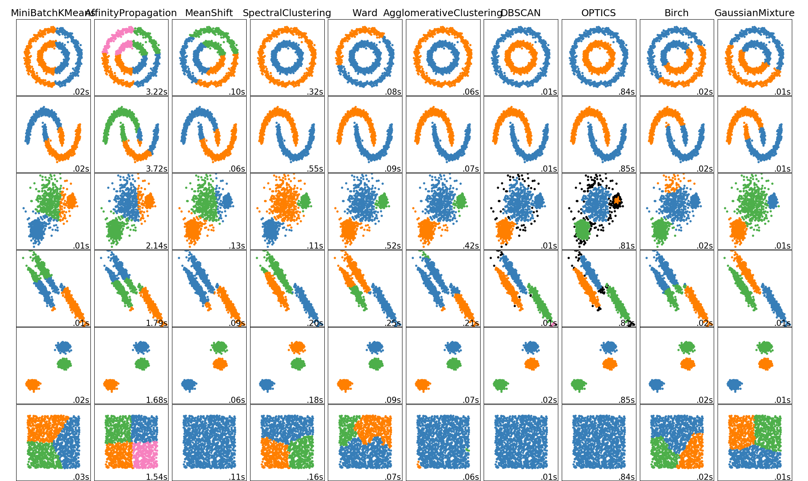

# Statistician {#statistician}

## Pipeline

*What is Data Science pipeline?*  

Data Science pipeline is simply a **set of all modules, which add up to a Data Science model**. Unfortunately, there is no unified view on this, as majority of Data Scientists approach their problems differently, as these are of different nature. I can put together a simpler one, as you will most likely start working on simpler datasets.

*What is a baseline model?*  

Baseline model is **the simplest solution to your Data Science hypothesis**. Before I get to show you how a baseline model might look like, let me first describe you the logic why *baseline model* is crucial for every (Citizen) Data Scientist.  

Firstly, we already mentioned on level Observer that we cannot be sure whether Machine Learning will work.

Secondly, we need to know whether when we do some improvement, if it had a positive impact on our predictive power.

Thirdly, we always need to know a way forward.

*What is resampling?*  

Putting aside a validation set and using it to evaluate model's performance is already a sound practice. More common is for a Data Scientist to use *resampling* or *cross-validation*. When we put aside validation data, we can be unfortunate and put aside a piece of data which is not representative of the overall population.  

Due to that, we repeat the process of putting aside certain percentage (for instance 20%) of our training data several times (for instance 5 times), while the data we put aside at every run will be different. Here is how it might look like.

**insert picture of cross-validation**

We do same procedure as before, just that this time we are going to receive 5 figures of accuracy of our model on validation data. Usually it is the case that model performs more or less similarly on all 5 sets. If it is not the case, you should consult with a Senior Data Scientist who will advice you about the steps (it is out of our scope on this level and usually dataset dependent).  

The only thing that you need to do now is to average these accuracies and you get even more robust view on the performance of your model. Great!

*What is factor encoding?*  

Most likely you remember that in first chapters of this book we talked about how our computers (and computing engines) view our data. Deep down all data are binary encoded into 1s and 0s, but from our point of view we have various forms of data that we would like to use. The most common data type that we would like to use (and can be problematic for our computer) are *categorical* features. Luckily for us, there are tons of frameworks and methods how we can properly represent a target feature to our algorithms.  

This is a very relevant practice. If you look at a framework called ` scikit-learn` under Python, which is by many considered industry standard, it does not allow for categorical features which are not **encoded**. 

**Give visual example**

The simplest method for factor encoding is so called **one-hot encoding**. We create a set of binary features (these are features which only contain two levels, such as 1s and 0s) out of our categorical feature (which can contain limitless number of levels). Here is how it looks.

**Give visual example of one-hot encoding**

*What is high cardinality?*  

Linear correlation


*What is feature importance?*  

As soon as you fit your first Machine Learning model and would like to use it in your company/project, people will ask - "Ok so what are the most important features for the model?". Not only we as humans have a natural curiosity, which makes us ask these kinds of questions, but it might be also *beneficial for the project*. What do we mean by feature importance?  

Even though we use 100 features in our model, it might happen that each one of them has different *importance* to our model. Let's say you would like to predict how many cups of coffee I drink every day. Here are features which you have available in your independent set:

- Weight
- Height
- Hours of sleep
- Hours at work
- Brand of clothes
- Number of meals per day
- Maritial status

Without using a model, let's think about how *important* these features can be for predicting my coffee consumption. Certainly, the more hours I work and the less hours I sleep, the more coffee I am going to consume. I might be the person who likes to drink a coffee after a meal, so number of meals per day can give us some sort of indication. Also, if I am higher and weight more, I might need more coffeine to feel refreshed, so these two features might also hold some information. I cannot imagine how the brand of clothes or maritial status can influence my coffee consumption.

Important:

- Hours of sleep
- Hours at work

Might be important/influential:

- Number of meals per day
- Weight
- Height 

Most likely unimportant:

- Maritial status
- Brand of clothes

The process through which we went, will be also a process through which your Machine Learning will go. It will use features which appear to be important and disregard the unimportant features. 

*How do I know which features were important for my model?*  

Look at the output of your linear or logistic regression.

## Productive Frameworks

*What are productive frameworks?*  

I will start off with a disclaimer that the term *productive frameworks* is most likely subjective to myself, so searching the internet for it might not be helpful. What I refer to when I say *productive framework* are Data Science frameworks which allow us to be, surprise - productive. There is a lot of them, in most of the languages related to Data Scince, but I will focus on several in this chapter:

- mlr
- mlrCPO
- recipes

*What is code reproducability?*  

Onebig reason why productive frameworks allow us to be productive, is that when we write code in them, they often times handle an issue of *code reproducability* for us. What is this issue about? It is about ensuring that whenever new data come to our Data Science pipeline, the code will do exactly what we expect it to do.

Let's now write a simple code which fulfills all of the requirements that we learned so far.

**put a simple train example**

What do we do now, if we want to deploy this model into production? The script which we just wrote, we will refer to as `train script` and we need to write also a second script called `predict script`. I think you already guessed it, the `predict script` will not train the model anymore, only make predictions for the unlabelled data. Now the question for us is, **how easy it is for us to construct a predict script**?  

One crucial point at this stage will be to save `states`. States refer to anything that we need in order to reproduce a particular step in our pipeline.  

## Decision Tree

*What are tree based models?*  

Tree based models are a new *family* of models on which we are going to expand our Machine Learning toolset. So far, we only relied on Linear Regression for regression problems and Logistic Regression for clasification problems. The downside of these models is that they are linear in nature while tree based models will allow us to work with non-linear problems usually better.

*What is a decision tree model?*  

If you have ever reasoned about something, you have most likely constructed a decision tree model in your mind. Let's say it is the last day before the birthday of your relative, which you of course forgot about and the small festive to celebrate the birthday is held tomorrow. You have no gift, while you would like to have some. Now comes the reasoning, as you arrived from work at 18:00 and the shops are closing soon, will you go out and buy the gift?  

- Is there some bookshop opened in the vicinity of 2 km? If no, you will certainly not go, you are too tired. If yes, let's consider further.
- Is it raining outside? If no, you will go. If yes, you reason further.
- Do you have a decent raincoat? If yes, you will go. If not, you will not go.

This small reasoning which we just did was a construction of a decision tree, here it is:

**insert an example of decision tree**

Now if we come back to Machine Learning, we can reuse the same concept which we just did to make classification model. When we will be in the process of *training* a decision tree, the tree will be trying to find these paths and rules based on which it should reason. How will it do though? It will always search for the best split in our data. Let's look at it.

**insert alternative view on decision tree pictures**

Let's now get to the fitting of a decision tree.

**put code example**

## Bagging, Boosting & Stacking

*What is bagging of ML models?*  

We now know how to construct following models:

- Linear Regression
- Logistic Regression (classification)
- Decision Tree (regression or classification)

We continue expanding our Machine Learning knowledge not by learning new sets of models, but by *combining our current models* to make one more powerful model. The first way of combining models is through **bagging** and I will also explain why combining of models is powerful.  

Let's assume you would like to predict what weather will be tomorrow in Vienna (without looking at weather prediction services). What you can do is that *you* make a guess. You are going to do a reasoning based on your experience:

- It is mid of December so it will be fairly cold.
- You visited Vienna two years ago in November and it was around 5 degrees Celsius, so December will be colder than that.
- You heard that Europe is sunny these days.

Based on your experience above, you will make a guess of 2 degrees Celsius. In this case you acted like **single decision tree**. How to make the prediction more accurate? By asking more people. The reason why this will make our prediction more accurate is that everyone has slightly different bacground and experience and when you average the predictions made by many people, it will most likely be more accurate than your sole prediction.

Mention also averaging models when we use cross-validation.

*What is random forest?*  

The above example of averaging people's prediction about a weather is an example of a **random forest**.

What is boosting of ML models?
What is XGboost?
What is stacking of ML models?

## Unsupervised learning - Clustering

*What is unsupervised learning?*  

Within unsupervised learning, we work with the very same data as in supervised learning, with only one difference - **there is no label (target feature)**. Imagine a classroom, whereas your task is to analyse performance of students. Suppose that you obtain from teachers grades of the students. These will act as your labels, thus you can use a supervised approach where your target feature are your afformentioned grades. As for your independent features, you will colelct everything from students' height, through how many hours they sleep, up until what they eat for brakfast. You fit a model exactly as we learned, such as linear regression and observe which features are the most impactful. Supervised approach can certainly work.  

```{r classroom, echo = FALSE, fig.cap='Analysing student performance. Picture by Pixabay.'}
knitr::include_graphics("resources/04-statistician/classroom.jpg")
```

What if, you do not have *grades* of students. Not only that, but you are unable to obtain from teachers, or students any feature that could represent how performant they are. What you do, to fulfill your task, is that you will apply **unsupervised learning**. You will try to group students with similar traits together - for instance you put together all students who eat good breakfast and sleep well. You come to a conclusion that approximately 10% of students do this. After grouping, based on these two characteristics, you find out that these students also behave well in the classroom and are enrolled for extracurriculum activities. You are not sure whether these students are *performant* but you managed to separate a group which posesses *similar* traits whereas these make sense with respect to the target of your exercise. This was an example of unsupervised learning, through **clustering**.

*What is clustering?*

Clustering is a field within unsupervised learning, which deals with creation of *clusters*. Clusters are simply groups of observations which posess similar traits, or characteristics. Under supervised learning, we had algorithms such as Linear or Logistic Regression. Here the story will be similar, we will learn algorithms such as K-Means clustering or Hierarchical Clustering.  

There is no *one-rules them all* algorithm. Though there are some basic algorithms, and more advanced ones. Look at the following picture developed by `scikit-learn`. *Rows* represent various kinds of data formats we might be facing. These data formats are purposely set up the way that human eye can right away see what is ideal grouping into clusters:  

- 2 clusters: Inner circle, outer circle.
- 2 clusters: Left shape, right shape.
- 3 clusters: Small shapes on left and right, large in middle.
- 3 clusters: The three lines.
- 3 clusters: The three circles.
- 1 cluster: There is no obvious separation.

*Columns* represent algorithms which are available to us to cluster the data correctly. I would like to point out three, which you will learn in this book:

- Column 1: This is a form of **K-Means** clustering.
- Column 5: This is a form of **hierarchical** clustering.
- Column 7: This is an advanced method of clustering, called **DBSCAN**.

```{r clustering-scikit, echo = FALSE, fig.cap='Comparison of clustering algorithms on various dataset forms. Picture by scikit-learn.'}

```

*What is K-Means clustering?*

K-Means is probably the simplest form of clustering. To demonstrate it properly (and to also compare it with other methods), we will use *iris* dataset. This is a famous dataset, as it is great for explaining concepts. The dataset looks like follows.

```{r iris-show, include=FALSE}
data(iris)
head(iris)
```

We have hence four measures of the flower, and various kinds of flowes. Just to be sure, this is how you recognise Petal and Sepal:

```{r iris-explained, echo = FALSE, fig.cap='Comparison of clustering algorithms on various dataset forms. Picture by scikit-learn.'}
knitr::include_graphics("resources/04-statistician/iris-explained.png")
```

Let's now take two out of these four features - Sepal Width and Petal Width. When we plot all observed flowers and using a colour we also highlight which Specie they are, it is clear that the flowers can be recognised by the two characteristics which we picked. Can k-means clustering find the same groups within the data so that we would be able to recognise the Species?

```{r iris-select, include=FALSE}
library(ggplot2)
ggplot(iris, aes(x = Petal.Width, y = Sepal.Width, col = Species)) + geom_point()
```

K-means clustering looks at your data from and drop at them K-number of points, for example 3 points. These points are dropped randomly into the space. 


*What is hierarchical clustering?*


*Why is distance so important?*

*What are common applications of clustering?*

1. Marketing : It can be used to characterize & discover customer segments for marketing purposes.
2. Biology : It can be used for classification among different species of plants and animals.
3. Libraries : It is used in clustering different books on the basis of topics and information.
4. Insurance : It is used to acknowledge the customers, their policies and identifying the frauds.
5. City Planning : It is used to make groups of houses and to study their values based on their geographical locations and other factors present.
6. Earthquake studies : By learning the earthquake affected areas we can determine the dangerous zones.

https://www.guru99.com/unsupervised-machine-learning.html

## Unsupervised learning - Data Reduction

*What is data reduction?*


## Feature Selection
*Why don't we use all features?*


What features can I always get rid of?
Do we need to manually select features?
What is regularization?
What if I want to use model that does not select features?


