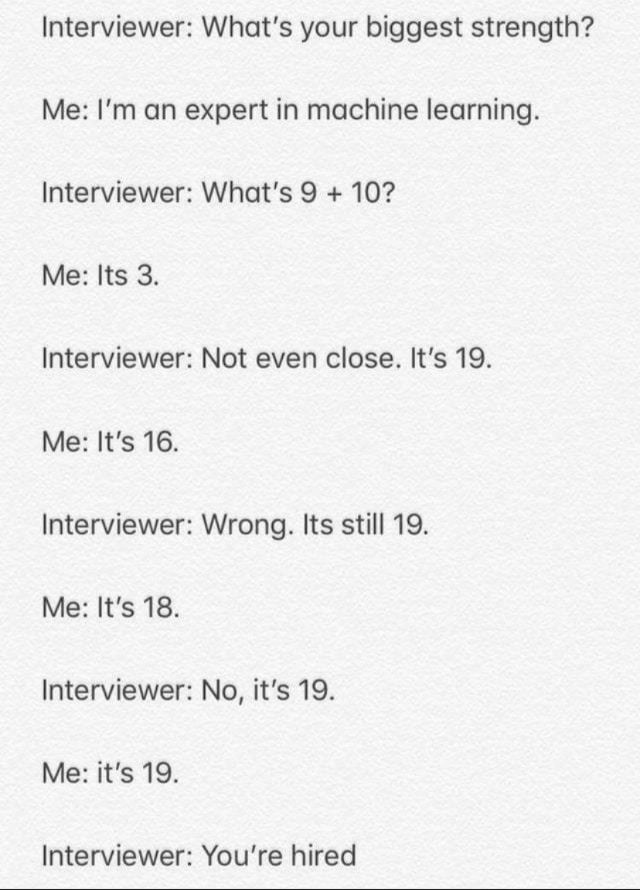

# Uncategorized topics {#uncategorized-topics}

This chapter contains a list of topics which I consider interesting but I am unable to currently categorize them anywhere.

Spark
Bayesian methods
Text processing
Topic modelling
Shell and Bash?

Be Curious
You are already at the level where curiosity will be what keeps you growing. With this chapter we are starting with a new practice that I will be leaving recommendations for additional sources that you can read 

Is Machine Learning Unethical or Racist?

Are data scientists evil? Is there a reason why to be scared of these stalkers?

Propensity models
Can two models and their respective probabilities be really compared?

Customer and user
You need to distinguish between the two

The falacy of absolute numbers
For many years what matters a lot is a conversion rate or a success rate. I recommend though to be careful with it.

Should I focus on how my code looks?
I have a saying: "People have feelings. They feel when you code like sh_t."

Long and wide format of data

A journalist asks a programmer: What makes a code bad?
Programmer: No comment

Parallel programming

Self-organizing maps

*How does my PC view features?*
Numerical and categorical features. This needs to come before Supervised Learning as I am explaning classification and regression. No it doesn't, it is explained only conceptually.

```{r machine learning, echo = FALSE, fig.cap='Posted by u/victor_stefan to r/ProgrammerHumor, Reddit.'}

```

*What is information leakage?*
One of the steps we need to ensure is to prevent *information leakage*. This happens in cases, where our independent features contain some *leaked* (or spoiler) information about our target feature. Let me give you an example. 


*What is correlation and causality?*

Make an example with babies and birds.