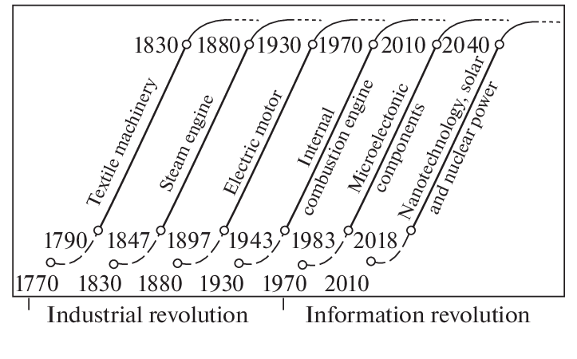

--- 
title: "Intuitive Data Science"
author: "Robert Barcik"
date: "`r Sys.Date()`"
site: bookdown::bookdown_site
documentclass: book
bibliography: [book.bib, packages.bib]
biblio-style: apalike
link-citations: yes
description: "This is a book that allows anyone to become a Citizen Data Scientist in an intuitive way."
---

# Foreword

Data Science is undoubtedly one of the fastest growing areas within IT. This growth is not unjustified though. Majority of the firms did undergo a process of digitalization within the past 2-3 decades. Opportunities within digitalization, such as digital offering of products, digital channels for marketing, are reaching new maturity points.  

According to microeconomics and its law of diminishing marginal utility, for every penny invested early into an activity, the benefit on this penny will be large. While if we keep investing, after certain time the investment of same penny will yield only much smaller benefit. Due to this reason, lots of companies are these days turning from digitalization (as a sole investment) into a related field of data science.  

```{r diminishing-utilitty, echo = FALSE, fig.cap='Display of Law of Diminishing Marginal Utility. The utility obtained from eating every next chocolate bar yields less utility, until the utility even starts to be negative.'}
knitr::include_graphics("resources/00-index/diminishing_utility.jpg")
```

This is supported by the fact that the process of digitalization inevitably collects data. Thereafter companies see that even with minimal investment into this trend, the benefits can be significant. If you would look at the past major drivers which influenced companies, you could observe something like this.

```{r technological-eras, echo = FALSE, fig.cap='Technologies which are driving markets throughout recent history.'}

```

And this is where you come in, with your opportunity to grow your career, naturally following what market is hungry for.

```{r include=FALSE}
# automatically create a bib database for R packages
knitr::write_bib(c(
  .packages(), 'bookdown', 'knitr', 'rmarkdown'
), 'packages.bib')
```

