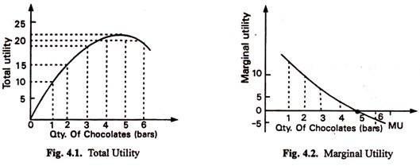

--- 
title: "Authentic Data Science"
author: "Robert Barcik"
date: "`r Sys.Date()`"
site: bookdown::bookdown_site
documentclass: book
bibliography: [book.bib, packages.bib]
biblio-style: apalike
link-citations: yes
description: "This is a book that allows anyone to become a Embedded Data Scientist in an intuitive way."
---

# Foreword to Authentic Data Science

Data Science is undoubtedly one of the fastest growing areas within IT. This growth is not unjustified though. Majority of the firms did undergo a process of digitalization within the past 2-3 decades. Opportunities within digitalization, such as digital offering of products, digital channels for marketing, are reaching new maturity points. If we look around ourselves, majority of products which make sense to be digitalized, indeed are (if we disregard laggard governments).  

According to microeconomics and its law of diminishing marginal utility, for every penny invested early into an activity, the benefit on this penny will be large. While if we keep investing, after certain time the investment of same penny will yield only much smaller benefit. Due to this reason, lots of companies are these days turning from digitalization (as a sole investment) into a related field of Data Science.  

```{r diminishing-utilitty, echo = FALSE, fig.cap='Display of Law of Diminishing Marginal Utility. The utility obtained from eating every next chocolate bar yields less utility, until the utility even starts to be negative.'}

```

This is supported by the fact that the process of digitalization inevitably collects data. Thereafter companies see that even with minimal investment into this trend, the benefits can be significant. Information and data are some of primary growth drivers of current decades.

And this is where you come in, with your opportunity to grow your career, naturally following what market is hungry for. If you have made (maybe even now) the big decision to join Data Science, you will ask *what* should you learn and *how*. I have seen many people discouraged during this path of Data Science learning, which was really saddening for me as I personally really enjoyed this path. It was bothering my mind until the point that I decided to write this book, to address what is currently lacking in the market:

- We as Data Scientists are poor teachers. There is a vast amount of books for new learners, but the reader will fall asleep more times than not while reading. There are numerous platforms and online courses, but these teach skills instead of highlighting clear path that a student should follow.
- We are asking newcomers to learn what we were taught - endless statistics, programming, lengthy math formulas. Is it really necessary though? The world of Data Science has changed and now there is a need for a new generation of Data Scientists to arise.

Both of these issues which I saw encouraged me to write this book. Already in the next chapter I will give you (hopefully) a fresh view on the *path* which you might take to become a Data Scientist. Secondly, I will teach you only the required concepts and rather encourage you to use your domain knowledge, may it be anything from Banking, through Medicine, up to Engineering - to apply successful Data Science. Finally, you will see that I give up all math formulas, lot of programming and try to explain you things in an intuitive way.

Enjoy the read,

Robert


```{r include=FALSE}
# automatically create a bib database for R packages
knitr::write_bib(c(
  .packages(), 'bookdown', 'knitr', 'rmarkdown'
), 'packages.bib')
```

## Current state of this book

Chapters where first draft is done and are ready for editing:

- Foreword.
- Being Aware. 
- Observer. 

Chapters currently in development:

- Contributor 
- Modeller 

Chapters where only basic framework has been outlined:

- Contributor Part I
- Contributor Part III
- Project Responsible
- Butter Knife
